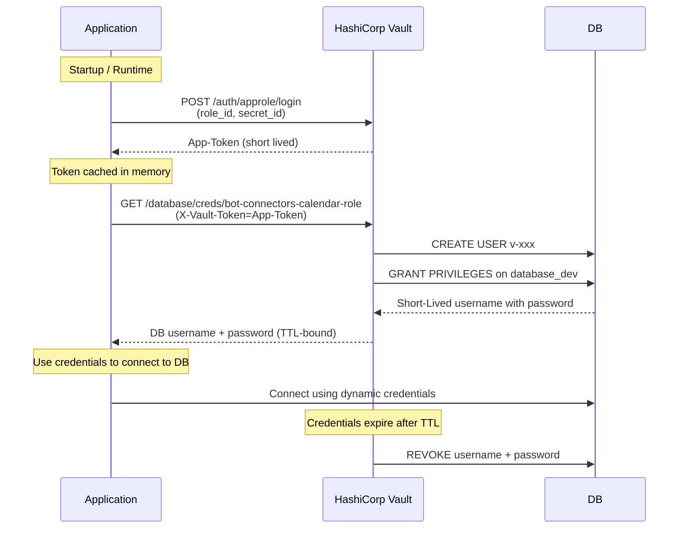
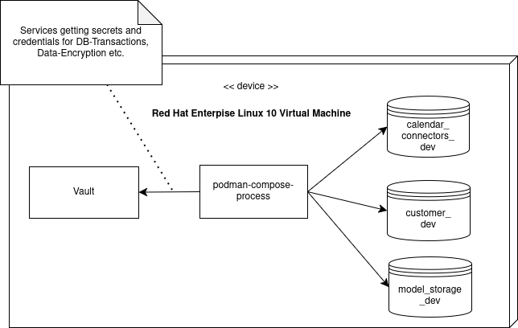

#                                      

**About arc42**

arc42, the template for documentation of software and system
architecture.

Template Version 9.0-EN. (based upon AsciiDoc version), July 2025

Created, maintained and © by Dr. Peter Hruschka, Dr. Gernot Starke and
contributors. See <https://arc42.org>.

# Introduction and Goals

## Requirements Overview

## Quality Goals

## Stakeholders

| Role/Name    | Contact         | Expectations        |
|--------------|-----------------|---------------------|
| *\<Role-1\>* | *\<Contact-1\>* | *\<Expectation-1\>* |
| *\<Role-2\>* | *\<Contact-2\>* | *\<Expectation-2\>* |

# Architecture Constraints

# Context and Scope

## Business Context

**\<Diagram or Table\>**

**\<optionally: Explanation of external domain interfaces\>**

## Technical Context

**\<Diagram or Table\>**

**\<optionally: Explanation of technical interfaces\>**

**\<Mapping Input/Output to Channels\>**

# Solution Strategy

# Building Block View

## Whitebox Overall System

***\<Overview Diagram\>***

Motivation  
*\<text explanation\>*

Contained Building Blocks  
*\<Description of contained building block (black boxes)\>*

Important Interfaces  
*\<Description of important interfaces\>*

### \<Name black box 1\>

*\<Purpose/Responsibility\>*

*\<Interface(s)\>*

*\<(Optional) Quality/Performance Characteristics\>*

*\<(Optional) Directory/File Location\>*

*\<(Optional) Fulfilled Requirements\>*

*\<(optional) Open Issues/Problems/Risks\>*

### \<Name black box 2\>

*\<black box template\>*

### \<Name black box n\>

*\<black box template\>*

### \<Name interface 1\>

…​

### \<Name interface m\>

## Level 2

### White Box *\<building block 1\>*

*\<white box template\>*

### White Box *\<building block 2\>*

*\<white box template\>*

…​

### White Box *\<building block m\>*

*\<white box template\>*

## Level 3

### White Box \<\_building block x.1\_\>

*\<white box template\>*

### White Box \<\_building block x.2\_\>

*\<white box template\>*

### White Box \<\_building block y.1\_\>

*\<white box template\>*

# Runtime View

## Dynamic Credential Handling for DB Access

1. The application starts and loads its RoleID and SecretID
2. The application authenticates against Vault using AppRole
3. Vault issues a short-lived client token
4. The application uses the token to request dynamic database credentials
5. Vault creates a temporary database user with limited privileges
6. The application connects to the database using these credentials
7. Credentials automatically expire and are revoked by Vault

Using this approach, the application does not need to store the database credentials
in its configuration. Instead, the application can request them from Vault at runtime.
Further, a strict TTL bound ensures that the credentials are only valid for a short
time.

### Security Characteristics

These aspects should be considered when implementing new or refactoring new features:

- No static database credentials are stored
- Vault tokens are short-lived and scoped by policy
- Database users are dynamically created and revoked
- Compromised credentials have limited blast radius
- Root credentials never leave Vault

## \<Runtime Scenario 2\>

## …​

## \<Runtime Scenario n\>

# Deployment View

## Infrastructure Dev-Stage - A High-Level View

The following deployment view shows the infrastructure elements used in the
development stage of the system. At this stage of documentation it shows only the High-
Level components of the infrastructure and how they are connected.

## Infrastructure Dev-Stage - A detailed View

The following infrastructure elements are used in the development
stage of the system.

### Motivation

During the MVP-Phase, the Dev-Stage Server is a virtual machine running on
a developers machine.
A client website can import the bot-pilot using *iframe* or *script* tag. The *src*
needs
to point to the Dev-Stage Server from where the frontend is served.
As an API Gateway, a *Caddy* webserver is used. This webserver is responsible for
routing the requests to the frontend. While developing in the MVP-Phase, the
microservices for backend functionality, the frontend and the caddy webserver are all
running on the same machine.
To run them, a docker-compose file is used. Doing so, the early product stage can be
deployed easily to evaluate the infrastructure and the architecture at this very early
stage.
The backend services are running behind another API Gateway (Caddy) and are not exposed
to the outside world. The frontend can access the backend services using the API
Gateway.
The backend services are using persistent Storages. For Relational Databases, a
MariaDB database is used. In the MVP-Stage, there are three different databases of
interest:

- **model_storage_dev**: Contains the trained model which the *rasa-core* service uses
  for predictions
- **calendar_connectors_dev**: The Storage for API Tokens for the calendar connectors
  such as *Google Calendar API* (MVP-Stage)
- **user_storage_dev**: The Storage for the user data such as the user's name, address,
  etc. (MVP-Stage)

The frontend is served using the React framework with Typescript and Vite as bundle
tool.
The Rasa Server (Core + NLU) is running with `Sanic`, an asynchronous web framework.
The Rasa Action-Server is running with `Flask` and is not implemented asynchronous.

### Quality and/or Performance Features

*\<explanation in text form\>*

### Mapping of Building Blocks to Infrastructure

*\<description of the mapping\>*

## Infrastructure Level 2

### *\<Infrastructure Element 1\>*

*\<diagram + explanation\>*

### *\<Infrastructure Element 2\>*

*\<diagram + explanation\>*

…​

### *\<Infrastructure Element n\>*

*\<diagram + explanation\>*

# Cross-cutting Concepts

## *\<Concept 1\>*

*\<explanation\>*

## *\<Concept 2\>*

*\<explanation\>*

…​

## *\<Concept n\>*

*\<explanation\>*

# Architecture Decisions

# Quality Requirements

## Quality Requirements Overview

## Quality Scenarios

# Risks and Technical Debts

# Glossary

| Term         | Definition         |
|--------------|--------------------|
| *\<Term-1\>* | *\<definition-1\>* |
| *\<Term-2\>* | *\<definition-2\>* |
