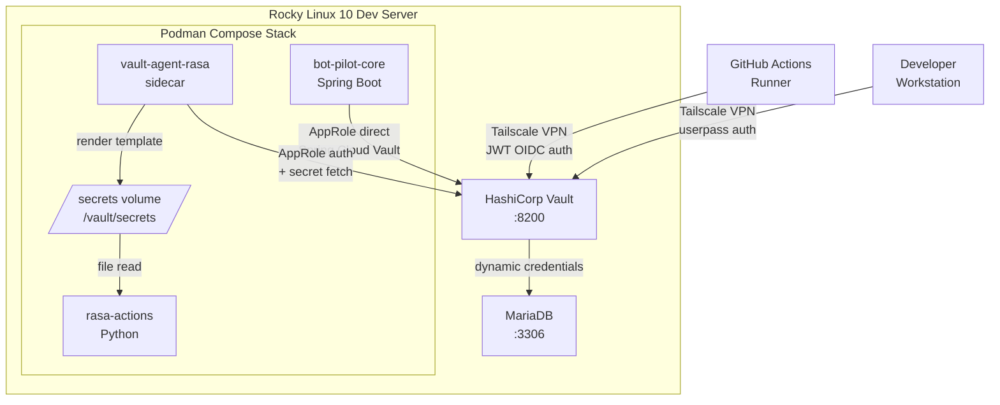
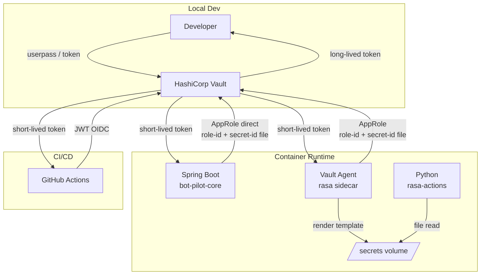
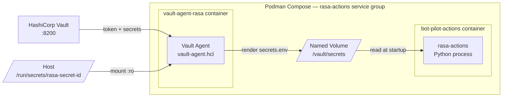
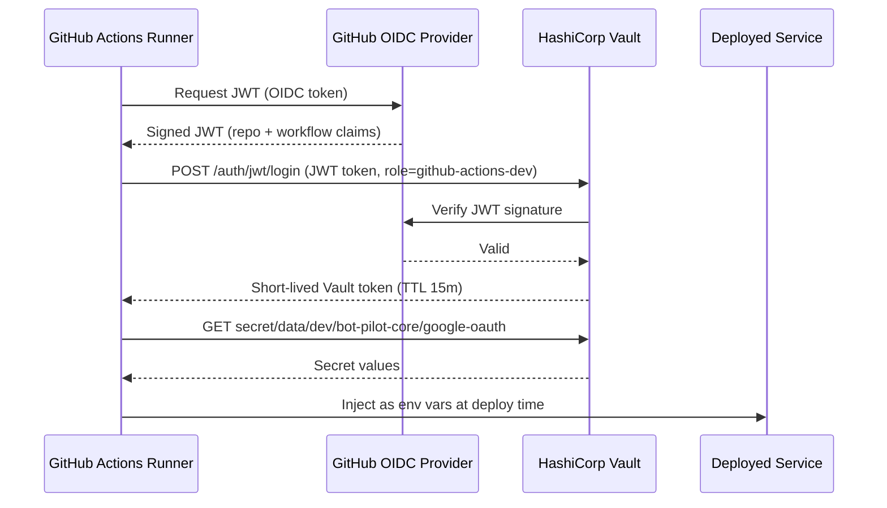

# HashiCorp Vault Architecture — bot-pilot

## Table of Contents

1. [Overview](#1-overview)
2. [Vault Deployment Architecture](#2-vault-deployment-architecture)
3. [Secrets Engines](#3-secrets-engines)
4. [Secret Path Namespace Convention](#4-secret-path-namespace-convention)
5. [Authentication Methods per Consumer](#5-authentication-methods-per-consumer)
6. [AppRole Strategy](#6-approle-strategy)
7. [Vault Agent Sidecar](#7-vault-agent-sidecar)
8. [Policy Design](#8-policy-design)
9. [Local Developer Workflow](#9-local-developer-workflow)
10. [CI/CD Integration](#10-cicd-integration)
11. [Encryption-as-a-Service (Transit Engine)](#11-encryption-as-a-service-transit-engine)
12. [Secret Renewal and Lease Management](#12-secret-renewal-and-lease-management)
13. [Operational Concerns](#13-operational-concerns)
14. [Implementation Roadmap](#14-implementation-roadmap)

---

## 1. Overview

This document defines the complete Vault architecture for bot-pilot across all
environments (local, dev-stage, future prod). It builds on top of the existing database
secrets engine and AppRole setup described
in [mariadb-vault-setup.md](mariadb-vault-setup.md).

### Consumers

| Consumer                                    | Runtime           | Language           | Auth Method                          | Secret Delivery          |
|---------------------------------------------|-------------------|--------------------|--------------------------------------|--------------------------|
| `bot-pilot-core` (connectors, faqs, runner) | Container / Local | Java (Spring Boot) | AppRole (Spring Cloud Vault)    | Spring Cloud Vault direct        |
| `rasa-actions`                              | Container / Local | Python             | AppRole via Vault Agent sidecar | Rendered file on shared volume   |
| GitHub Actions CI/CD                        | Cloud runner      | Shell              | JWT (OIDC)                      | hashicorp/vault-action           |
| Developer (local)                           | Workstation       | —                  | Userpass / Token                | Vault CLI                        |

### Approach per Service Type

**`bot-pilot-core`** uses Spring Cloud Vault directly without a sidecar. Spring Cloud
Vault is a first-class Vault integration for Spring: it handles AppRole authentication,
token renewal, dynamic DB credential lease rotation, and KV binding to
`@ConfigurationProperties` beans — all without any extra infrastructure. A Vault Agent
sidecar would duplicate what Spring Cloud Vault already owns and add an unnecessary
moving part.

**`rasa-actions`** uses a Vault Agent sidecar. Python has no equivalent of Spring Cloud
Vault. The alternative — a hand-rolled `hvac` renewal thread — is fragile and carries
real failure modes (thread crash, TTL race on restart). Vault Agent offloads the entire
auth lifecycle to a dedicated process and delivers secrets as rendered files. The Python
service becomes a file reader with zero Vault client code.

### Environments

| Environment                     | Vault Instance                                                     | Notes                                                           |
|---------------------------------|--------------------------------------------------------------------|-----------------------------------------------------------------|
| `local` (developer workstation) | Shared dev Vault on Rocky Linux 10 server, reached over Tailscale | No local Vault process — developers connect remotely            |
| `dev`                           | Rocky Linux 10 dev server (single node, Raft)                     | Running production-like Vault; same instance used by local devs |
| `prod`                          | TBD (same pattern, separate instance)                             | Auto-unseal via cloud KMS recommended                           |

---

## 2. Vault Deployment Architecture

### Current State (Dev Stage)

A single-node Vault using Integrated Raft storage runs on the Rocky Linux 10 dev server.



### Future: HA / Prod

For `prod`, run Vault in HA mode (3-node Raft cluster) with:

- Auto-unseal via a cloud KMS (e.g., AWS KMS, GCP Cloud KMS) so restarts don't require
  manual intervention
- TLS termination at Vault itself (not a reverse proxy, to preserve mTLS option)

---

## 3. Secrets Engines

### Enable These Engines

```bash
# KV v2 — static application secrets
vault secrets enable -path=secret kv-v2

# Database — dynamic MariaDB credentials (already configured per mariadb-vault-setup.md)
vault secrets enable database

# Transit — encryption-as-a-service
vault secrets enable transit
```

### Engine Responsibilities

| Engine   | Path        | Purpose                                                              |
|----------|-------------|----------------------------------------------------------------------|
| KV v2    | `secret/`   | Static secrets: OAuth client IDs/secrets, API keys, config values    |
| Database | `database/` | Dynamic MariaDB credentials per service role                         |
| Transit  | `transit/`  | Encrypt/decrypt sensitive data at rest without the app managing keys |

---

## 4. Secret Path Namespace Convention

Use a three-level hierarchy: `{engine}/{env}/{service}/{key-group}`

```
secret/
├── local/
│   ├── bot-pilot-core/
│   │   └── google-oauth          # client-id, client-secret, redirect-uri
│   └── rasa-actions/
│       └── config                # any Python service secrets
├── dev/
│   ├── bot-pilot-core/
│   │   └── google-oauth
│   └── rasa-actions/
│       └── config
└── prod/
    ├── bot-pilot-core/
    │   └── google-oauth
    └── rasa-actions/
        └── config

database/
  ├── config/bot-pilot-core-local
  ├── config/bot-pilot-core-dev
  ├── roles/bot-pilot-core-role-local
  └── roles/bot-pilot-core-role-dev

transit/
└── keys/
    └── bot-pilot-data-key        # encryption key for sensitive stored data
```

### Write Static Secrets Example

```bash
# Dev environment — Google OAuth
vault kv put secret/dev/bot-pilot-core/google-oauth \
  client-id="<value>" \
  client-secret="<value>" \
  redirect-uri="https://dev.bot-pilot.example.com/oauth2/callback"

# Local environment
vault kv put secret/local/bot-pilot-core/google-oauth \
  client-id="<value>" \
  client-secret="<value>" \
  redirect-uri="http://localhost:8082/oauth2/callback"
```

---

## 5. Authentication Methods per Consumer

### Auth Methods to Enable

```bash
vault auth enable approle   # Services (Java + Python / Vault Agent)
vault auth enable jwt       # GitHub Actions OIDC
vault auth enable userpass  # Local developer access
```

### Auth Flow Overview



---

## 6. AppRole Strategy

**One AppRole per service**, not per environment. The environment is encoded in the path
the AppRole is permitted to access via its policy. This keeps AppRole management
simple — you rotate secret-ids per service, not per service×environment.

For `rasa-actions`, the AppRole credentials are consumed by the Vault Agent sidecar, not
by the Python process itself. The Python process never touches Vault directly.

| AppRole Name     | Service             | Auth Consumer        | Policy                        |
|------------------|---------------------|----------------------|-------------------------------|
| `bot-pilot-core` | Spring Boot runner  | Spring Cloud Vault   | `bot-pilot-core-{env}-policy` |
| `rasa-actions`   | Python Rasa service | Vault Agent sidecar  | `rasa-actions-{env}-policy`   |

### Secret-ID Delivery per Environment

| Environment                     | Delivery Mechanism                                                                                                                                                          |
|---------------------------------|-----------------------------------------------------------------------------------------------------------------------------------------------------------------------------|
| `local` (developer workstation) | Developer authenticates via `userpass`, generates a personal secret-id, stores it in `~/.vault-secrets/` on their workstation; service reads it via `VAULT_SECRET_ID_FILE` |
| `dev` (container on dev server) | Secret-id file is pre-provisioned on the host at container start; mounted read-only into the Vault Agent sidecar container (not the app container directly)                 |
| `prod`                          | Secret-id injected at deploy time by CI/CD (using Vault JWT auth), written to host path, mounted into the agent sidecar                                                     |

### AppRole Configuration

```bash
# bot-pilot-core AppRole
vault write auth/approle/role/bot-pilot-core-dev \
  token_ttl=1h \
  token_max_ttl=24h \
  token_policies="bot-pilot-core-dev-policy" \
  secret_id_ttl=0 \
  secret_id_num_uses=0

# rasa-actions AppRole (consumed by Vault Agent sidecar)
vault write auth/approle/role/rasa-actions-dev \
  token_ttl=1h \
  token_max_ttl=24h \
  token_policies="rasa-actions-dev-policy" \
  secret_id_ttl=0 \
  secret_id_num_uses=0

# Read role-ids (safe to embed in config/image)
vault read auth/approle/role/bot-pilot-core-dev/role-id
vault read auth/approle/role/rasa-actions-dev/role-id

# Generate secret-ids (treat like a password — never commit)
vault write -f auth/approle/role/bot-pilot-core-dev/secret-id
vault write -f auth/approle/role/rasa-actions-dev/secret-id
```

---

## 7. Vault Agent Sidecar

### What Vault Agent Does

Vault Agent is a long-running daemon that runs alongside an application container. It
handles:

- **Authentication**: Performs the AppRole login against Vault and obtains a token. The
  application never sees or manages a Vault token.
- **Token renewal**: Renews the token automatically before expiry. No application code
  required.
- **Secret fetching and template rendering**: Reads secrets from Vault and renders them
  to files using Go templates. The application reads rendered files — it does not call
  the Vault API.
- **Secret caching**: When configured with a persistent cache, the agent can serve
  previously-fetched secrets from its cache even if Vault is temporarily unreachable.
  This is a meaningful resilience benefit over direct SDK calls.

### Why It Fits Podman Compose

In Kubernetes, the sidecar pattern is native. In Podman Compose it requires explicit
composition: the agent runs as a separate service sharing a named volume with the app
service. The app container depends on the agent being ready. This is straightforward to
express in `docker-compose.yml` and is the correct pattern for non-orchestrated container
stacks.

There are no init containers in Podman Compose. The agent must be started before the
app, enforced via `depends_on` with a health check.

### Trade-offs vs Direct SDK Approach

| Concern                    | Vault Agent Sidecar                                     | Direct SDK (hvac)                                        |
|----------------------------|---------------------------------------------------------|----------------------------------------------------------|
| Auth lifecycle             | Owned by the agent — zero app code                     | App must implement login + renewal thread                |
| Token expiry edge cases    | Agent handles all TTL / max-TTL logic                  | App must handle expiry during sleep, restart races       |
| Language agnosticism       | Any language reads files                               | Every language needs its own Vault client library        |
| Secret delivery            | Files on a shared volume                               | In-process API call                                      |
| Outage resilience          | Cache survives short Vault downtime                    | App sees connection errors immediately                   |
| Operational complexity     | Extra container, health check, volume dependency       | Simpler compose file, one fewer moving part              |
| Debugging                  | Must inspect agent logs separately from app logs       | All errors surface in the app process directly           |
| Startup ordering           | App must wait for agent to render secrets before start | Spring Cloud Vault blocks startup until secrets are read |
| Secret update notification | App must poll or watch the file for changes            | Spring Cloud Vault publishes a RefreshEvent              |

### When to Use Vault Agent

The Vault Agent sidecar is used for `rasa-actions` only. `bot-pilot-core` uses Spring
Cloud Vault directly — see §5 Auth Flow and §12 for the reasoning.

### Sidecar Architecture for rasa-actions



The agent container mounts the secret-id file from the host. The app container mounts
only the shared `secrets` volume — it has no host path mounts and no knowledge of Vault.

### Vault Agent Configuration

```hcl
# vault-agent.hcl — used by vault-agent-rasa sidecar container
# Place at: bot-pilot-chat/backend/rasa-actions/container/vault-agent.hcl

vault {
  address = "http://vault:8200"   # service name on dev-network; replace with IP or FQDN in prod
}

auto_auth {
  method "approle" {
    config = {
      role_id_file_path   = "/vault/config/role-id"
      secret_id_file_path = "/run/secrets/rasa-secret-id"
    }
  }

  sink "file" {
    config = {
      path = "/vault/token"
    }
  }
}

# Cache serves secrets from memory if Vault is briefly unreachable
cache {
  use_auto_auth_token = true
}

template {
  source      = "/vault/templates/secrets.env.ctmpl"
  destination = "/vault/secrets/secrets.env"
  perms       = 0640
  # Agent re-renders this file when the secret lease is renewed
}
```

The `role-id` for `rasa-actions` is not sensitive and can be embedded in the container
image or provided via environment variable. Mount it as a file at `/vault/config/role-id`
at startup:

```yaml
# In docker-compose.yml — vault-agent-rasa service
environment:
  - RASA_VAULT_ROLE_ID=<role-id-value>
```

Or write it to the host and mount it the same way as the secret-id.

### Secret Template

```
{{- /* bot-pilot-chat/backend/rasa-actions/container/secrets.env.ctmpl */ -}}
{{- with secret "secret/data/dev/rasa-actions/config" -}}
RASA_SOME_API_KEY={{ .Data.data.some_api_key }}
RASA_OTHER_SECRET={{ .Data.data.other_secret }}
{{- end }}
```

Vault Agent re-renders this file each time it renews the secret lease or detects a new
KV version. The Python process reads the rendered `secrets.env` at startup (or re-reads
it on SIGHUP if live reload is needed).

### Reading the Rendered File in Python

```python
# actions/config.py
import os
from pathlib import Path


def load_vault_secrets(path: str = "/vault/secrets/secrets.env") -> None:
    """Load Vault-rendered secrets into os.environ at startup.

    Called once at process start. The file is written by the Vault Agent
    sidecar before this process starts (enforced via depends_on health check).
    Raises FileNotFoundError if the agent has not written secrets yet —
    this is an intentional fail-fast: do not catch this exception at startup.
    """
    secrets_file = Path(path)
    for line in secrets_file.read_text().splitlines():
        line = line.strip()
        if not line or line.startswith("#"):
            continue
        key, _, value = line.partition("=")
        os.environ[key.strip()] = value.strip()
```

Call `load_vault_secrets()` before any Rasa action handler accesses credentials. No
`hvac` import, no renewal thread, no token management — the application is fully
decoupled from Vault's protocol.

### Compose Integration

```yaml
# Additions to docker-compose.yml

  vault-agent-rasa:
    image: hashicorp/vault:1.17          # pin to a specific release in prod
    container_name: vault-agent-rasa
    restart: unless-stopped
    networks:
      - dev-network
    volumes:
      - ./bot-pilot-chat/backend/rasa-actions/container/vault-agent.hcl:/vault/config/vault-agent.hcl:ro,Z
      - ./bot-pilot-chat/backend/rasa-actions/container/secrets.env.ctmpl:/vault/templates/secrets.env.ctmpl:ro,Z
      - /home/norman/rasa_secret_id.cert:/run/secrets/rasa-secret-id:ro,Z
      - rasa-secrets:/vault/secrets
    environment:
      - VAULT_ADDR=http://vault:8200
    command: ["vault", "agent", "-config=/vault/config/vault-agent.hcl"]
    healthcheck:
      test: ["CMD", "test", "-f", "/vault/secrets/secrets.env"]
      interval: 5s
      timeout: 3s
      retries: 10
      start_period: 10s

  bot-pilot-actions:
    build:
      context: ./bot-pilot-chat/backend/rasa-actions
      dockerfile: ./container/Containerfile_actions
    container_name: bot-pilot-actions
    restart: unless-stopped
    depends_on:
      vault-agent-rasa:
        condition: service_healthy    # blocks until secrets.env exists
    networks:
      - dev-network
    environment:
      - ACTIONS_LOG_LEVEL=debug
    volumes:
      - rasa-secrets:/vault/secrets:ro  # read-only — app never writes here
    ports:
      - "5055:5055"

volumes:
  rasa-secrets:   # anonymous named volume shared between agent and app
```

The health check on `vault-agent-rasa` tests for the existence of `secrets.env`. The
`bot-pilot-actions` service will not start until that file is present, eliminating the
startup race entirely.

### Security Notes on the Shared Volume

- The volume is writable only by the agent container. The app container mounts it
  `:ro`.
- File permissions on `secrets.env` are set to `0640` by the agent (`perms` in the
  template stanza). The file is only readable by the agent process user and group.
- Do not mount the secrets volume into any other container. It is scoped to this service
  group.
- Never log the contents of `secrets.env` or any value loaded from it.

### What Changes for the rasa-actions Python Service

- Remove all `hvac` imports and the `VaultClient` class.
- Remove `VAULT_ADDR`, `RASA_VAULT_ROLE_ID`, and `VAULT_SECRET_ID_FILE` environment
  variables from the app container.
- Call `load_vault_secrets()` at process startup.
- Access credentials via `os.environ` as before — existing action handlers need no
  changes beyond removing direct Vault calls.

---

---

## 8. Policy Design

Policies follow the principle of least privilege. Each service only reads the paths it
actually needs.

The `rasa-actions` policy is applied to the Vault Agent's token, not to the Python
process. The Python process holds no Vault token at all.

### Naming Convention

`bot-pilot-{service}-{env}-policy`

### `bot-pilot-core-dev-policy.hcl`

```hcl
# Dynamic DB credentials for the calendar connector
path "database/creds/bot-pilot-core-dev-role" {
  capabilities = ["read"]
}

# Static secrets — Google OAuth
path "secret/data/dev/bot-pilot-core/google-oauth" {
  capabilities = ["read"]
}

# Token self-renewal
path "auth/token/renew-self" {
  capabilities = ["update"]
}

path "auth/token/lookup-self" {
  capabilities = ["read"]
}
```

### `rasa-actions-dev-policy.hcl`

```hcl
# Static secrets for the Rasa Python service — read by Vault Agent, not the app
path "secret/data/dev/rasa-actions/config" {
  capabilities = ["read"]
}

# Token self-renewal — used by Vault Agent
path "auth/token/renew-self" {
  capabilities = ["update"]
}

path "auth/token/lookup-self" {
  capabilities = ["read"]
}
```

### `github-actions-dev-policy.hcl`

```hcl
# CI/CD: read app secrets to inject into deployment config
path "secret/data/dev/bot-pilot-core/*" {
  capabilities = ["read"]
}

path "secret/data/dev/rasa-actions/*" {
  capabilities = ["read"]
}

# Deny access to database creds — services fetch these themselves
path "database/*" {
  capabilities = ["deny"]
}
```

### `developer-local-policy.hcl`

```hcl
# Full read access to local secrets
path "secret/data/local/*" {
  capabilities = ["read", "list"]
}

path "secret/metadata/local/*" {
  capabilities = ["list"]
}

# Allow generating secret-ids for local AppRoles (for local testing)
path "auth/approle/role/bot-pilot-core-dev/secret-id" {
  capabilities = ["create", "update"]
}

path "auth/approle/role/rasa-actions-dev/secret-id" {
  capabilities = ["create", "update"]
}
```

### Apply Policies

```bash
vault policy write bot-pilot-core-dev-policy   bot-pilot-core-dev-policy.hcl
vault policy write rasa-actions-dev-policy     rasa-actions-dev-policy.hcl
vault policy write github-actions-dev-policy   github-actions-dev-policy.hcl
vault policy write developer-local-policy      developer-local-policy.hcl
```

---

## 9. Local Developer Workflow

Vault runs exclusively on the dev server — there is no local Vault instance. Developers
connect to the shared dev Vault over Tailscale using personal `userpass` credentials and
authenticate from their workstation directly against the remote Vault.

### Authentication

```bash
# One-time setup — authenticate against the remote dev Vault
export VAULT_ADDR=http://<dev-server-tailscale-ip>:8200
vault login -method=userpass username=<your-name>
```

The token is cached by the Vault CLI in `~/.vault-token`. It is scoped to
`developer-local-policy`, which grants read access to `secret/local/*` and the ability
to generate AppRole secret-ids.

### Fetching AppRole Secret-IDs for Local Service Runs

When running `bot-pilot-core` locally, the developer generates a personal secret-id
from the remote Vault and stores it on their workstation:

```bash
# Generate and store a secret-id for bot-pilot-core
vault write -f auth/approle/role/bot-pilot-core/secret-id \
  | jq -r '.data.secret_id' > ~/.vault-secrets/bot-pilot-core-secret-id

# Point the service at the remote Vault
export VAULT_ADDR=http://<dev-server-tailscale-ip>:8200
export CONNECTORS_VAULT_APP_ROLE_ID=$(vault read -field=role_id auth/approle/role/bot-pilot-core/role-id)
export VAULT_SECRET_ID_FILE=$HOME/.vault-secrets/bot-pilot-core-secret-id
```

The Spring Boot `application.yml` picks these up via the existing environment variable
bindings — no code changes required for local runs.

When running `rasa-actions` locally without the full Compose stack, either:

- Run `vault agent` locally pointing at the remote Vault, or
- Use the Rasa test profile (no Vault, secrets stubbed via environment variables)

For local integration testing with the full stack, the Vault Agent sidecar connects to
the remote dev Vault over Tailscale in the same way any other container does — no
special handling needed.

### Developer Onboarding Checklist

1. Install Vault CLI: `sudo dnf install vault` (RHEL) or `brew install vault`
2. Install Tailscale and connect to the dev network
3. Obtain `userpass` credentials from the project maintainer
4. Set `VAULT_ADDR` to the dev server Tailscale IP (add to `~/.zshrc` or `~/.bashrc`)
5. Run `vault login -method=userpass username=<name>`
6. Generate AppRole secret-ids and store under `~/.vault-secrets/`
7. Add `~/.vault-secrets/` and `~/.vault-token` to `~/.gitignore_global` — never commit
   these

---

## 10. CI/CD Integration

### Strategy: GitHub Secrets for Infra, Vault for App Secrets

Keep infrastructure-level secrets (SSH keys, Tailscale OAuth, Docker Hub token) in
GitHub Secrets — these are needed to bootstrap the pipeline itself and have no
application-level sensitivity in Vault. Application secrets (Google OAuth, future API
keys) should be fetched from Vault during deployment.

| Secret                                      | Where stored                                    | Rationale                     |
|---------------------------------------------|-------------------------------------------------|-------------------------------|
| `DEV_SSH_PRIVATE_KEY`                       | GitHub Secrets                                  | Infrastructure bootstrap      |
| `DEV_SSH_HOST` / `DEV_SSH_USER`             | GitHub Secrets                                  | Infrastructure bootstrap      |
| `TS_CLIENT_ID` / `TS_CLIENT_SECRET`         | GitHub Secrets                                  | Needed to reach Vault         |
| `BOT_PILOT_CONFIG_TOKEN`                    | GitHub Secrets                                  | GitHub PAT, managed by GitHub |
| `DOCKER_HUB_USERNAME` / `DOCKER_HUB_TOKEN`  | GitHub Secrets                                  | Registry access               |
| `GOOGLE_OAUTH_CLIENT_ID/SECRET`             | Vault `secret/dev/bot-pilot-core/google-oauth`  | Application secret            |

### GitHub Actions OIDC → Vault JWT Auth

Configure Vault to trust GitHub's OIDC provider so Actions workflows can authenticate
without a stored secret:

```bash
vault auth enable jwt

vault write auth/jwt/config \
  oidc_discovery_url="https://token.actions.githubusercontent.com" \
  bound_issuer="https://token.actions.githubusercontent.com"

vault write auth/jwt/role/github-actions-dev \
  role_type="jwt" \
  bound_audiences="https://vault.dev.bot-pilot.example.com" \
  user_claim="actor" \
  bound_claims='{"repository":"normanboettcher/bot-pilot"}' \
  policies="github-actions-dev-policy" \
  ttl="15m"
```

### GitHub Actions Workflow Integration

Add a step to the deployment workflow using `hashicorp/vault-action`:

```yaml
- name: Import secrets from Vault
  uses: hashicorp/vault-action@v3
  id: vault
  with:
    url: ${{ secrets.VAULT_ADDR }}
    method: jwt
    role: github-actions-dev
    secrets: |
      secret/data/dev/bot-pilot-core/google-oauth client-id | GOOGLE_OAUTH_CLIENT_ID ;
      secret/data/dev/bot-pilot-core/google-oauth client-secret | GOOGLE_OAUTH_CLIENT_SECRET
```

### Auth Flow: GitHub Actions → Vault



---

## 11. Encryption-as-a-Service (Transit Engine)

If bot-pilot stores sensitive user data (PII, calendar content, conversation history) in
MariaDB, use Vault's Transit engine to encrypt it before storage. The application never
holds the encryption key — only ciphertext is stored.

### Setup

```bash
vault secrets enable transit

vault write transit/keys/bot-pilot-data-key \
  type="aes256-gcm96"
```

### Transit Policy for Encryption

```hcl
# Add to bot-pilot-core-dev-policy.hcl if encryption is needed
path "transit/encrypt/bot-pilot-data-key" {
  capabilities = ["update"]
}

path "transit/decrypt/bot-pilot-data-key" {
  capabilities = ["update"]
}
```

### Usage Pattern

```java
// Encrypt before storing
VaultOperations vault = ...;
String ciphertext = vault.opsForTransit()
        .encrypt("bot-pilot-data-key", Base64.encode(plaintext));
// Store ciphertext in DB

// Decrypt after fetching
String plaintext = vault.opsForTransit()
        .decrypt("bot-pilot-data-key", ciphertext);
```

---

## 12. Secret Renewal and Lease Management

### Spring Boot / bot-pilot-core (Spring Cloud Vault Direct)

Spring Cloud Vault handles the full lifecycle without any application code:

- Performs AppRole login at startup using the `role-id` env var and `secret-id` file
- Renews the Vault token before it expires
- Re-fetches dynamic DB credentials before the lease lapses and refreshes the DataSource
- Publishes a `RefreshEvent` so `@ConfigurationProperties` beans are re-bound with new
  KV values

Verify that `token_ttl=1h` and `token_max_ttl=24h` on the AppRole match your deployment
restart cadence. Spring Cloud Vault handles renewal automatically within those bounds —
no operator action required.

### Python rasa-actions (Vault Agent Sidecar)

The Vault Agent sidecar owns the full renewal lifecycle. The Python process does nothing:

- The agent renews its token before expiry.
- When a KV secret is updated in Vault, the agent detects the new version and
  re-renders `secrets.env`.
- The Python process reads `secrets.env` at startup only. If live secret rotation is
  needed, send SIGHUP to the process to trigger a re-read — add a signal handler that
  calls `load_vault_secrets()` again.

The `hvac` library and the hand-rolled renewal thread from the previous design are
removed entirely. No application-layer Vault lifecycle code remains in `rasa-actions`.

---

## 13. Operational Concerns

### Unseal Strategy

| Environment | Unseal Method                     | Notes                                                         |
|-------------|-----------------------------------|---------------------------------------------------------------|
| `dev`       | Manual Shamir (3-of-5 key shares) | Store key shares offline, split between team members          |
| `prod`      | Auto-unseal via cloud KMS         | Required for automated restarts without operator intervention |

Store Shamir unseal keys and root token in an encrypted offline medium (e.g.,
GPG-encrypted file, password manager vault). Never store them in the repository or
GitHub Secrets.

### Vault Agent Container Lifecycle

The Vault Agent sidecar is marked `restart: unless-stopped`. If it crashes, Podman
restarts it. On restart, the agent re-authenticates with AppRole and re-renders secrets.
The Python app continues running with stale secrets from `os.environ` until it restarts
or receives a SIGHUP.

If Vault itself is sealed or unreachable, the agent's cache can serve previously-fetched
secrets for the duration of the cached token TTL. Beyond that, the agent cannot renew
and the secrets file will not be updated. The Python process will continue with the last
known values until it restarts.

### Audit Logging

```bash
sudo mkdir -p /var/log/vault && sudo chown vault:vault /var/log/vault
vault audit enable file file_path=/var/log/vault/audit.log
```

Ship audit logs to a central log aggregator (e.g., Loki, ELK). Vault audit logs are
append-only and log every request/response — treat them as security-sensitive.

### Backup Strategy

Raft integrated storage can be snapshotted:

```bash
# Create a snapshot
vault operator raft snapshot save /var/backups/vault/vault-$(date +%Y%m%d).snap

# Automate via cron or systemd timer
```

Verify snapshots can be restored to a test instance before relying on them.

### Secret Rotation

- **Dynamic DB credentials**: Vault rotates these automatically on TTL expiry. No
  operator action needed.
- **AppRole secret-ids**: Rotate by generating a new secret-id, updating the file on the
  host, and revoking the old accessor via
  `vault write -f auth/approle/role/{role}/secret-id-accessor/destroy`. The Vault Agent
  sidecar picks up the new file on its next auth cycle (or container restart).
- **KV static secrets**: Rotate manually when API keys change. The Vault Agent
  re-renders the template on the next lease renewal. Use KV v2 versioning — old versions
  remain readable for rollback.
- **Root token**: After initial setup, revoke the root token and generate a new one only
  when needed for break-glass operations.

---

## 14. Implementation Roadmap

### Phase 1 — Foundation (Immediate)

- [x] Database secrets engine enabled and configured (see `mariadb-vault-setup.md`)
- [x] AppRole for `bot-pilot-core` configured and working in dev
- [ ] Enable KV v2 at `secret/`
- [ ] Write Google OAuth secrets to `secret/dev/bot-pilot-core/google-oauth`
- [ ] Update Spring Boot `application.yml` to read `google-oauth` from Vault KV
- [ ] Create `userpass` auth method and accounts for developers

### Phase 2 — Service Coverage

- [ ] Create AppRole for `rasa-actions`
- [ ] Apply least-privilege policies for all services
- [ ] Write `vault-agent-rasa.hcl` and `secrets.env.ctmpl` under
      `bot-pilot-chat/backend/rasa-actions/container/`
- [ ] Add `vault-agent-rasa` service to `docker-compose.yml` with health check
- [ ] Update `bot-pilot-actions` service with `depends_on: vault-agent-rasa` and
      `rasa-secrets` volume mount (read-only)
- [ ] Add `load_vault_secrets()` to `rasa-actions` startup path
- [ ] Remove `hvac` VaultClient and renewal thread from `rasa-actions`

### Phase 3 — CI/CD Integration

- [ ] Enable JWT auth method in Vault
- [ ] Configure GitHub OIDC trust and `github-actions-dev` role
- [ ] Add `hashicorp/vault-action` step to `dev-deployment.yml`
- [ ] Remove app secrets from GitHub Secrets (keep infra secrets)

### Phase 4 — Hardening

- [ ] Enable TLS on Vault listener (replace `tls_disable = true`)
- [ ] Enable Transit engine for sensitive data encryption
- [ ] Automate Raft snapshots via systemd timer
- [ ] Document break-glass root token recovery procedure
- [ ] Implement secret-id rotation procedure and runbook
- [ ] Pin Vault Agent container image to a specific release tag
